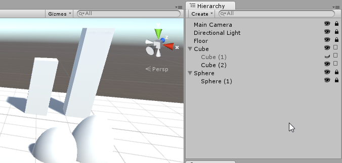
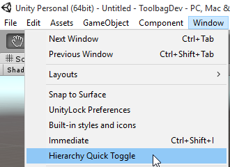

Hierarchy Quick Toggle
===

Hierarchy Quick Toggle adds icons in the Hierarchy view to quickly hide or lock objects in the scene, similar to Photoshop's layer view.

Usage
---
Place the QuickToggle folder in your project. The toggles can be turned on and off by going to `Window>Hierarchy Quick Toggle`

Compatibility
---

Quick Toggle duplicates functionality of [Unity Lock](../UnityLock).

There are no major problems with using both at the same time, but Unity Lock's `Show Lock Ion in Hierarchy` option will cover up Quick Toggle's icons or vice versa.
